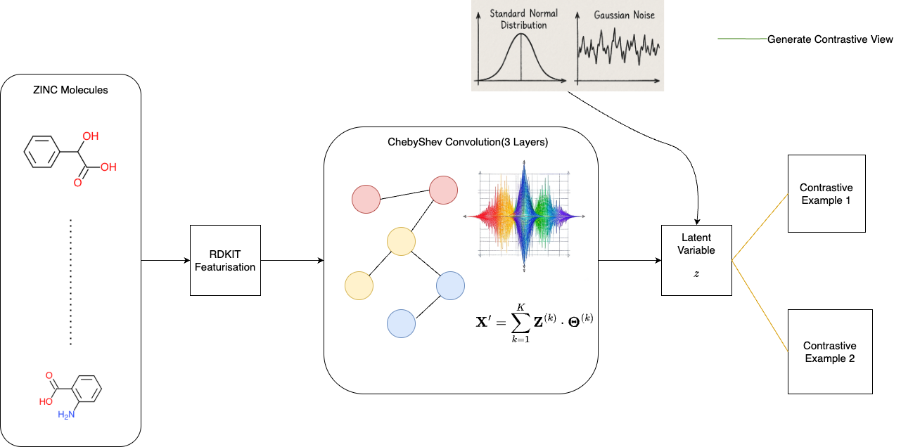
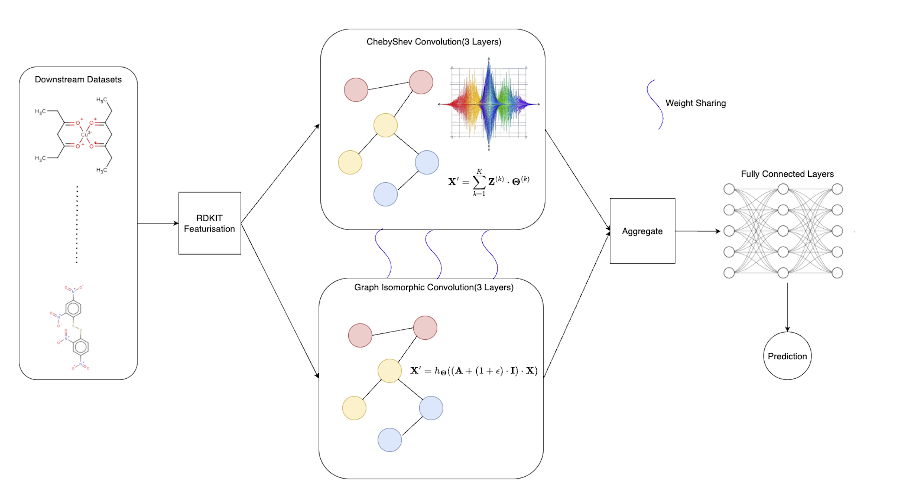

# Edge Sensitivity Based Gradient Attacks
Official code of our paper "An edge sensitivity based gradient attack on graph isomorphic networks for graph classification problems" accepted in Scientific Reports. Link will be added after publication.

## Contrastive Pre-Training


## Downstream Task



## Running the Scripts
- Create a Python(preferrably >3.10) virtual environment and activate it. Run the following command
```sh
pip install -r requirements.txt
```
- Create a ```.env``` file and set the values of all environment variables. 
- We use custom dataloaders and datasets of MoleculeNet owing to bugs in some of the datasets from Torch Geometric. The scripts for the same can be found <a href="https://github.com/Deceptrax123/Molecular-Graph-Featuriser">here</a>.


## Datasets
```sh
HIV
Tox21
BBBP
Clintox
Liphophilicity
```

## Dependencies
```sh
torch
python-dotenv
torch-geometric
torchmetrics
scikit-learn
numpy
scipy
python-dotenv
matplotlib
wandb
os
```

## Bugs/Queries
If there are any bugs, you may raise an issue using the standard issue template. If there are any technical questions regarding the project, you may email me at smudge0110@icloud.com.
